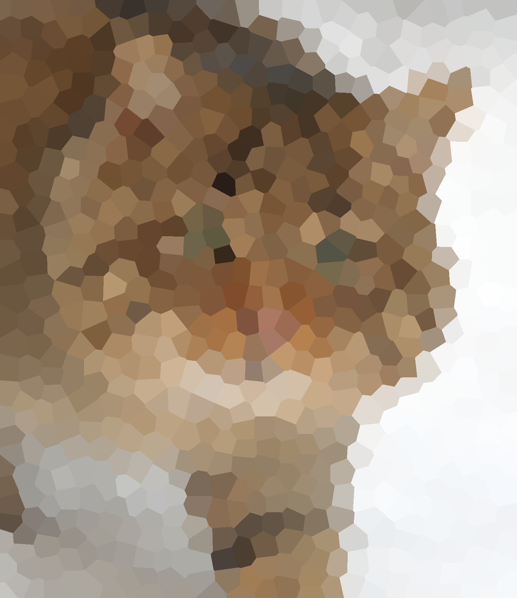
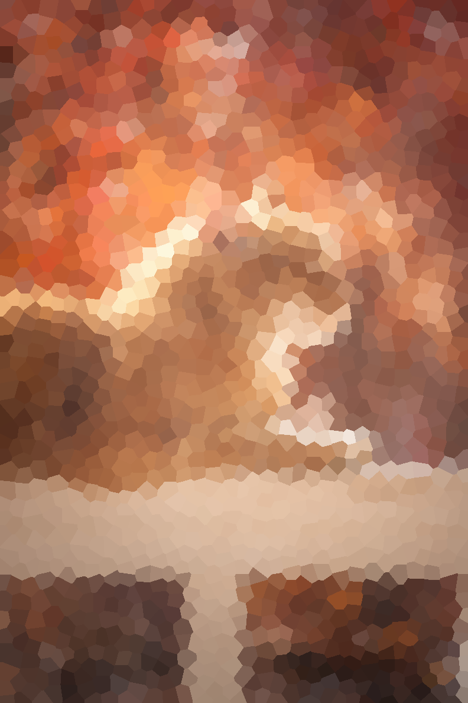

# Voronoi Image Filter
Apply a Voronoi filter to images.

# Example usage

The [run.py](vif/run.py) script contains a sample usage case for the Voronoi image filter and the included Poisson-disc
sampling method.

Example usage:
```shell script
python cat_original.jpg --point-radius 20 --memory-save-mode
```

Using a Wikimedia Commons [cat picture](https://commons.wikimedia.org/wiki/File:Felis_silvestris_silvestris.jpg)
([Copyright Michael Gäbler](https://commons.wikimedia.org/wiki/User:Michael_Gäbler)):



Or using a
[cat photo by Bekka Mongeau from Pexels](https://www.pexels.com/photo/tabby-cat-on-white-wooden-fence-804475/):


